# Real-Time Graphics & VFX Experiments 

## Overview
| Magic Gift Box | Dark Magic Sludge | Toxic Liquid |
| :---: | :---: | :---: |
| 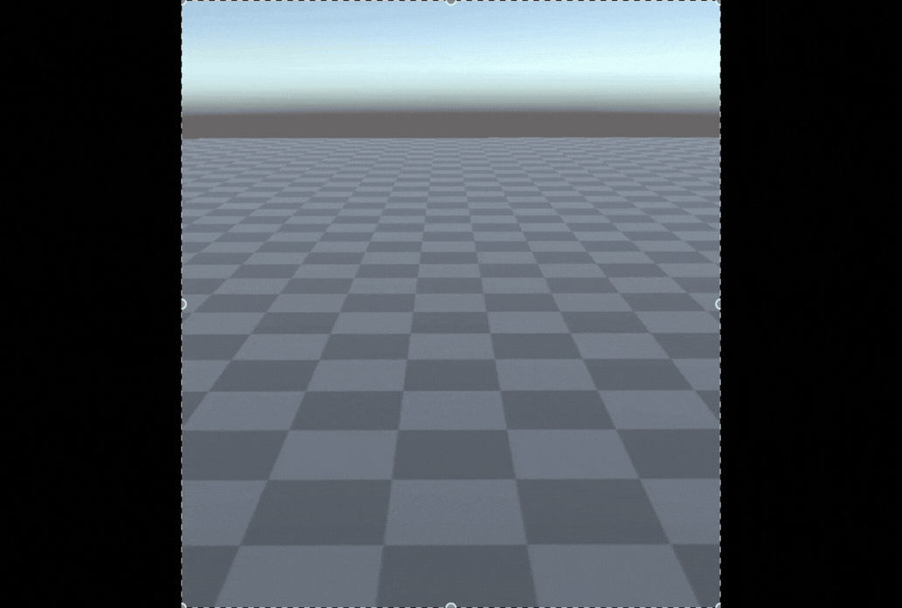 | 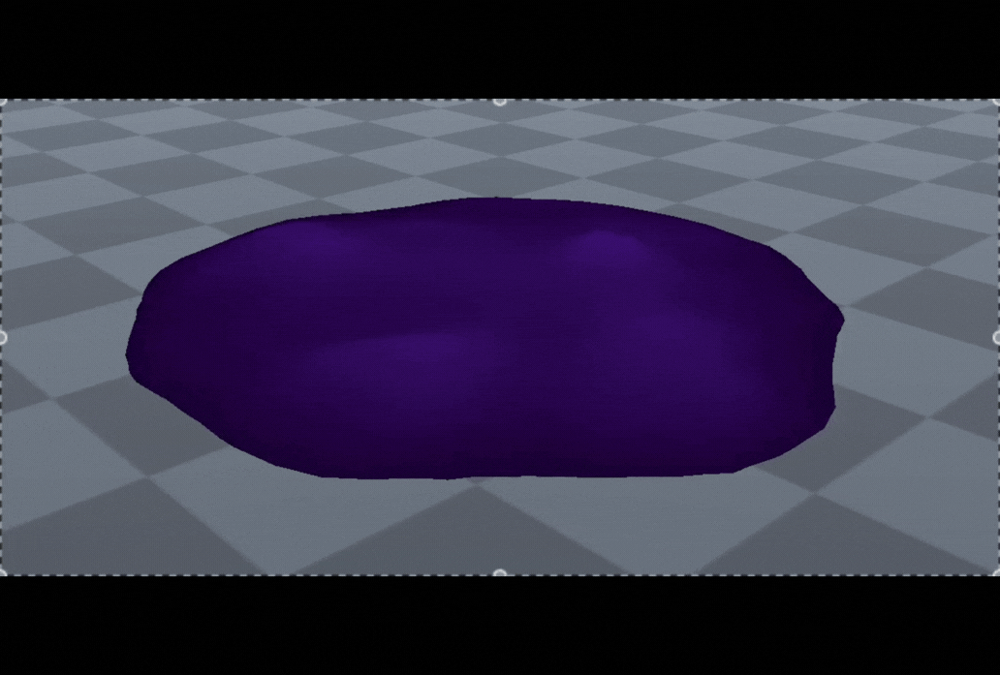 | 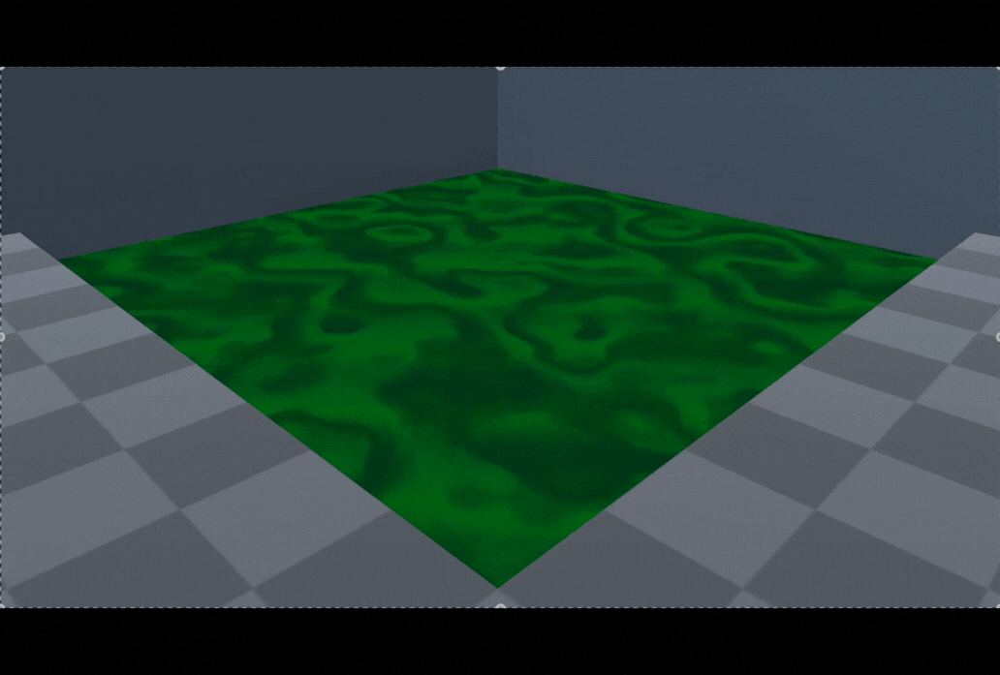 |
| Stretching & Squashing | Vertex Distortion | Texture Distortion |

Made in Unity's Built-in pipeline, but can be easily ported to other pipelines like URP.

## Stretching & Squashing
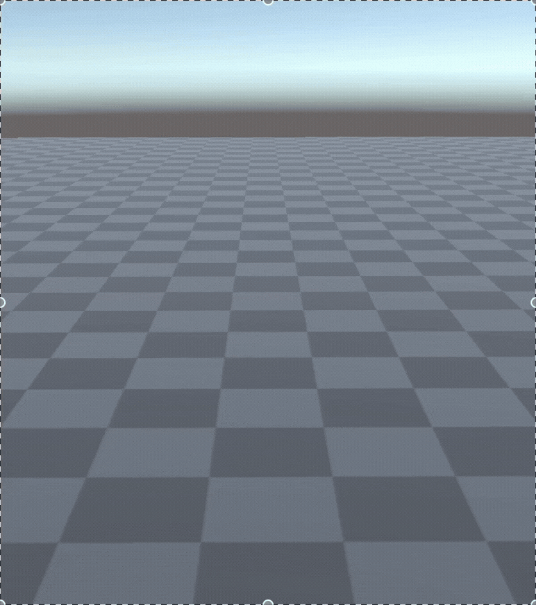

### Main Idea
- By manipulating the size-over-lifetime curves, we can create a "stretch and squash" effect, making the animation more lively.
- Squashing can be achieved by increasing X and Z scales while decreasing the Y scale.
- Stretching can be achieved by decreasing X and Z scales while increasing the Y scale.

| X axis / Z axes curve | Y axis curve |
| :---: | :---: |
| 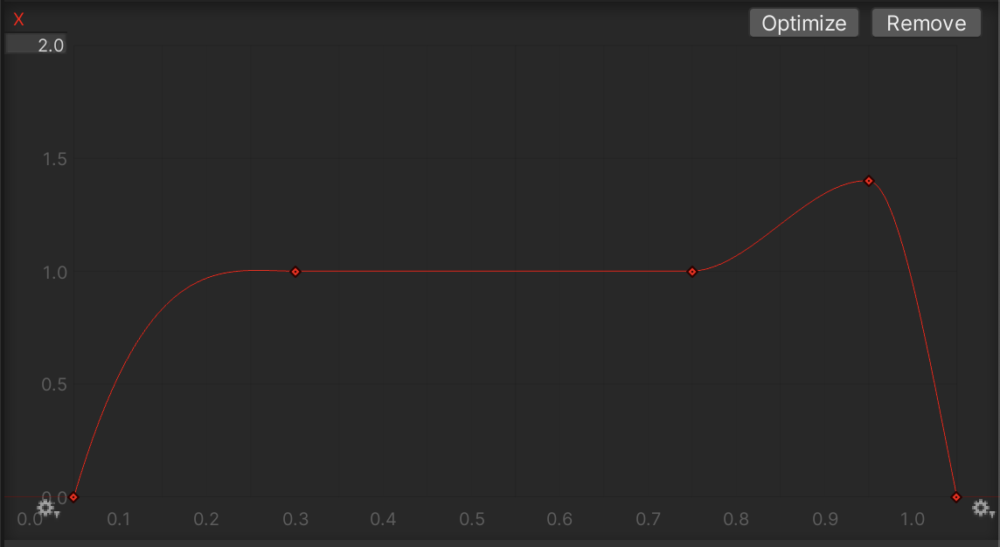 | 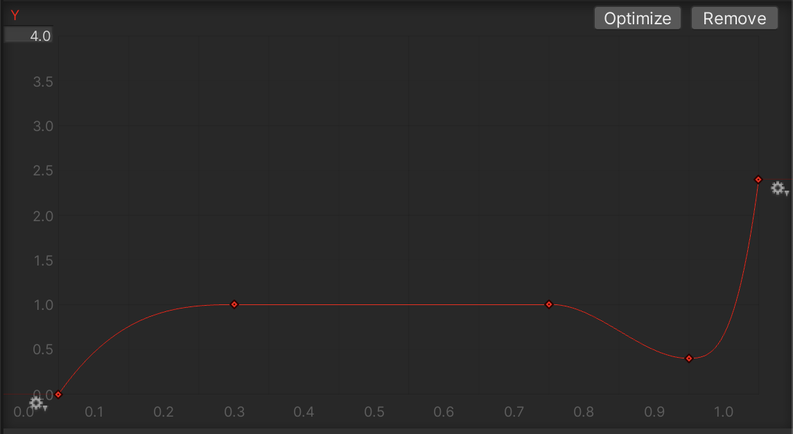 |

Squashing starts from 0.75 and ends at 0.95, while stretching starts from 0.95 and ends at 1.00.

## Vertex Distortion
| Preview | Side View |
| :---: | :---: |
| 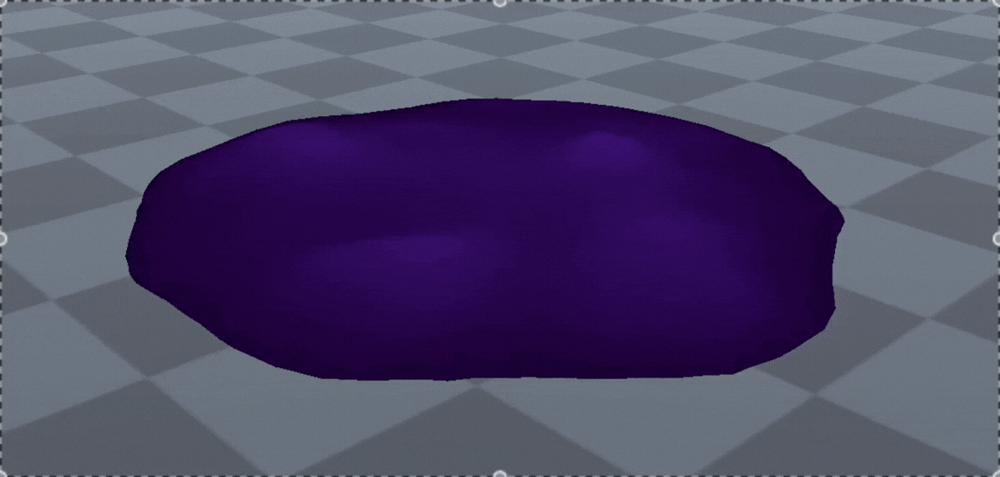 | 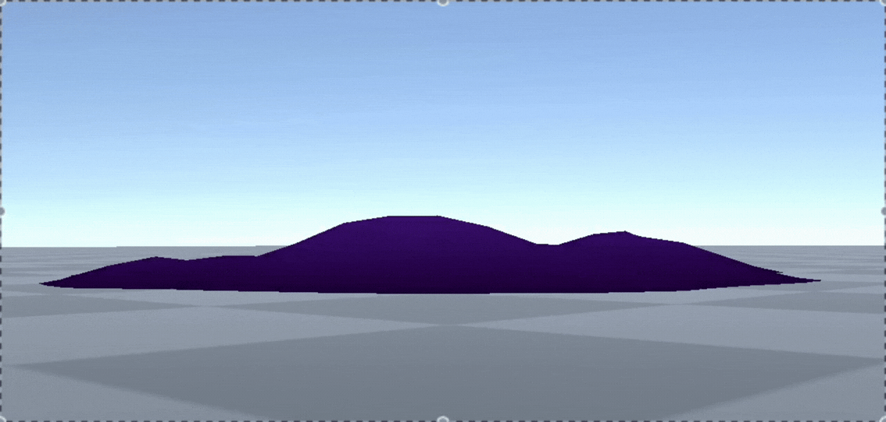 |

It can also be used as particle to provide a slimy splash effect.

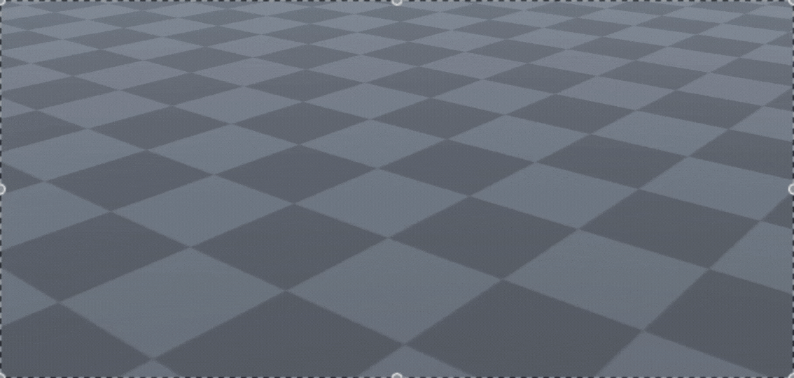
The drying up of the puddle is achieved by moving the particle downward, which leaves only the peak of the puddle viewable.

### Main Idea
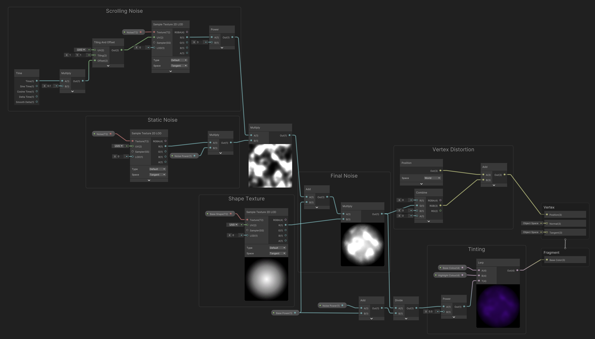

Parameters:
- Base Shape: 2D texture, determines the shape of the distortion
- Noise: 2D noise texture, can be replaced by a Simple Noise node
- Base Colour: The colour of the object
- Highlight Colour: The colour of the points of maximum distortion
- Base Power: The base height of the distortion
- Noise Power: The maximum height of the distortion

Main Logic:
- Use the colour of noise as the height.
  - 0/black has minimal displacement.
  - ≥ 1/white has maximum displacement
- Move the noise texture continously with time as offset.
- Multiply with the scrolling noise with static noise to create moving noise that changes in both shape and offset. 
  - In practice, this creates peaks that fluctuate in height.
- Multiply with the base shape texture to manipulate where peaks are allowed.
  - In the sample, the radial gradient ensure peaks starts to descend as it reaches the edge, creating a circular puddle.
  - The final noise shows the area where peaks can occur.
- Translate noise into vertical displacement (G, which is represents the Y-axis).
- Determine colour of fragment by performing linear extrapolation between the base colour and highlight colour with the noise (height) as input.

## Texture Distortion
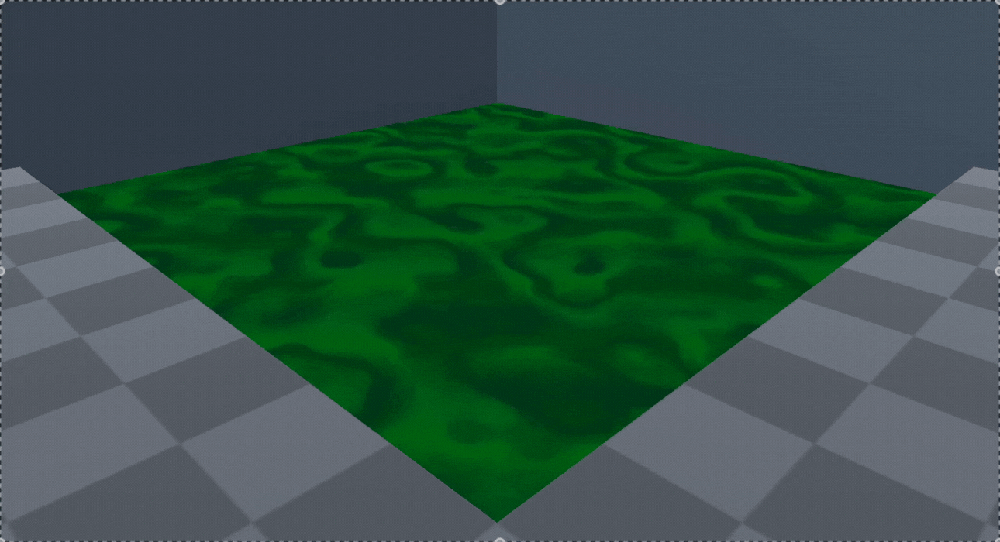

### Main Idea
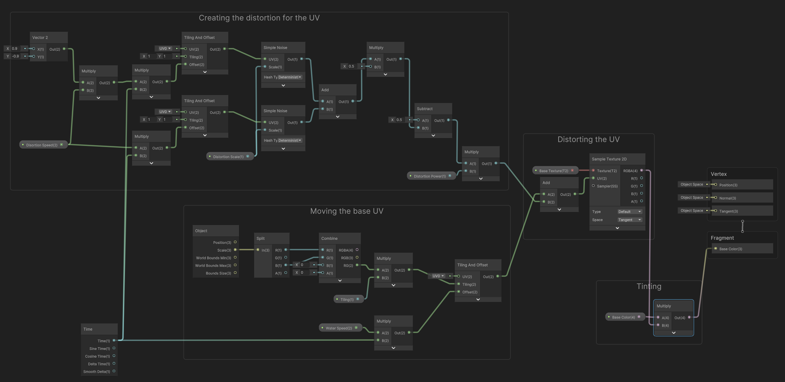

Note that the shader is designed with the default plane in mind.

Parameters:
- Base Texture: 2D texture to be distorted
- Base Colour: The tint applied on the final output
- Tiling: The tiling of the base texture independent of scale of plane
- Water Speed: The scrolling speed of the base texture.
- Distortion Power: Determines how distorted the texture becomes
- Distortion Scale: The scale of the Simple Noise used
- Distortion Speed: The scrolling speed of the noise

Main Logic:
- Use noise to represent how much a point should be distorted.
  - 0/Black has no displacement.
  - ≥ 1/White has maximal displacement.
- Combine 2 scrolling noises (with different speeds) to create a less repetitive pattern.
- Determine the actual tiling with both the parameter "Tiling" and the scale of the plane.
- Move the base texture continously with time as offset.
- Add the noise to the scrolling UV of the base texture to introduce offset
- Tint the texture to allow for variety and flexibility.